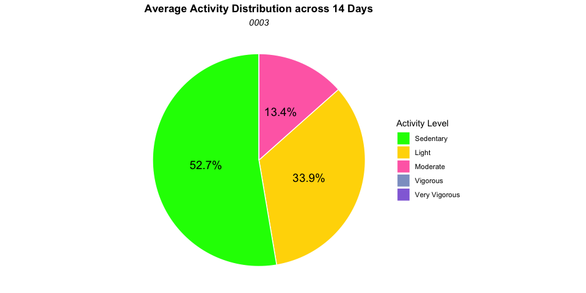
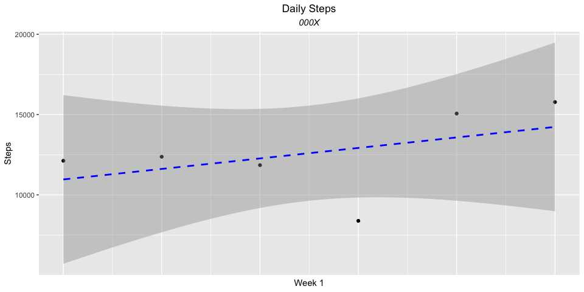

# Data Cleaning

Take the participant’s “subjectdaystats” file and delete rows not part
of the participant’s wear days. Rename the file to XXXdaystats. Upload
this CSV file to R. Assign the cleaned data file to a new object called
“activity_clean”. Create a new column called “Day” that is 1-15. Change
the date format to “Month”,“Day”, “Year”. Make new columns for each
activity level ie. look for “sedentary, count” and find the digits
directly after that. Filter so only it only shows Days 2-15

``` r
### hide r code and packages


library(tidyverse)
library(dplyr)
library(mice)
library(knitr)

library(stringr)
setwd(dir = "/Users/jade/Desktop/TC/MEND")
data <- read.csv(file = "0009daystats.csv")

# clean up the data so there is a  column for each activity level 
# example: look for "sedentary, count" and find the digits directly after 
#create a new column called "Day" that is 1-15 
#change the date format so it is Month,Day,Year 

activity_clean <- data %>%
group_by(Subject) %>%
  mutate(
    Date = format(as.Date(Date), "%m-%d-%Y"),
    Day = 1:n(),
    Sedentary = as.numeric(str_extract(WearFilteredCutPoints, '(?<="Sedentary","Count":)\\d+')),
    Light     = as.numeric(str_extract(WearFilteredCutPoints, '(?<="Light","Count":)\\d+')),
    Moderate  = as.numeric(str_extract(WearFilteredCutPoints, '(?<="Moderate","Count":)\\d+')),
    Vigorous  = as.numeric(str_extract(WearFilteredCutPoints, '(?<="Vigorous","Count":)\\d+')),
    `Very Vigorous`  = as.numeric(str_extract(WearFilteredCutPoints, '(?<="Very Vigorous","Count":)\\d+'))
  
  ) %>%
  filter(Day >= 2 & Day <= 15)
#just include days 2-15 
```

# Data Transformation and Summary

Reshape data to long format and calculate average counts and percentages
for each activity level. For each activity level, take the average
counts and turn it into a percentage so it shows the percentage of time
the participant spent in each activity level

``` r
activity_chart <- activity_clean %>%
  group_by(Subject)%>%
  select(Day, Sedentary, Light, Moderate, Vigorous,`Very Vigorous`)  %>%
  pivot_longer(cols = c(Sedentary,Light, Moderate,Vigorous,`Very Vigorous`),
               names_to = "Activity",
               values_to = "Count")
activity_chart
```

    ## # A tibble: 70 × 4
    ## # Groups:   Subject [1]
    ##    Subject   Day Activity      Count
    ##      <int> <int> <chr>         <dbl>
    ##  1       9     2 Sedentary       752
    ##  2       9     2 Light           531
    ##  3       9     2 Moderate        157
    ##  4       9     2 Vigorous          0
    ##  5       9     2 Very Vigorous     0
    ##  6       9     3 Sedentary      1077
    ##  7       9     3 Light           295
    ##  8       9     3 Moderate         68
    ##  9       9     3 Vigorous          0
    ## 10       9     3 Very Vigorous     0
    ## # ℹ 60 more rows

``` r
activity_summary <- activity_chart %>%
  group_by(Subject,Activity) %>%
  summarise(Average = mean(Count, na.rm = TRUE))%>%
  mutate(Percent = round(Average / sum(Average) * 100, 1))%>%
  mutate(Activity = factor(Activity, levels = c("Sedentary","Light", "Moderate", "Vigorous","Very Vigorous")))
```

# Average Activity Distribution (Pie Chart)

Create a pie chart showing the activity intensity distribution

``` r
ggplot(activity_summary, aes(x = "", y = Average, fill = Activity)) +
  geom_bar(stat = "identity", width = 1, color = "white") +
  coord_polar("y", start = 0) +
  geom_text(
    aes(label = ifelse(Percent >0, paste0(Percent,"%"), "")),
    position = position_stack(vjust = 0.5),
    color = "black",
    size = 5
  ) +
  scale_fill_manual(values = c(
    "Sedentary" = "#00FF00",
    "Light"    = "#FFD700",
    "Moderate" = "#FF6EB4",
    "Vigorous" = "#8da0cb",
    "Very Vigorous" = "#9370DB"
    
  ))+
  labs(
    title = "Average Activity Distribution across 14 Days",
    subtitle = "000X",
    fill = "Activity Level"
  ) +
  theme_void() +
  theme(plot.title = element_text(hjust = 0.5, face = "bold"),
        plot.subtitle = element_text(hjust = 0.5, face = "italic") 
  )
```

<!-- --> **Figure 1**
displaying the activity intensity distribution for the participant
across 14 days.

# Daily Steps Plot

Create separate plots for Week 1( Day 2-7) and Week 2( Day 8-15) and add
a shaded confidence interval

``` r
ggplot(filter(activity_clean, Day >= 2 & Day <= 7),
       aes(x = Day, y = WearFilteredSteps)) +
  geom_point() +
  geom_smooth(method = "lm", se = TRUE, color = "blue", linetype = "dashed") + 
  theme(
    plot.title = element_text(hjust = 0.5),
    plot.subtitle = element_text(hjust = 0.5, face = "italic"),
    axis.ticks.x = element_blank(),
    axis.text.x = element_blank(),
  ) +
  labs(
    title = "Daily Steps",
    subtitle = "000X",
    x = "Week 1",
    y = "Steps"
  )

ggplot(filter(activity_clean, Day >= 8 & Day <= 15),
       aes(x = Day, y = WearFilteredSteps)) +
  geom_point() +
  geom_smooth(method = "lm", se = TRUE, color = "blue", linetype = "dashed") + 
  theme(
    plot.title = element_text(hjust = 0.5),
    plot.subtitle = element_text(hjust = 0.5, face = "italic"),
    axis.ticks.x = element_blank(),
    axis.text.x = element_blank(),
  ) +
  labs(
    title = "Daily Steps",
    subtitle = "000X",
    x = "Week 2",
    y = "Steps"
  )
```


**Figure 2** displays the daily steps for the participant across 14 days
