# 1. Data Cleaning & Transformation

<p style="font-size:20px;">
Take the master sheet “Master_Data_05_07_26.csv” file that contains the
participants wear days data. Assign the cleaned data file to a new
object called “activity_clean”. Create a new column called “Day” that is
2-15. Change the date format to “Month”,“Day”, “Year”. Make new columns
for each activity level ie. look for “sedentary, count” and find the
digits directly after that. Filter so only it only shows Days 2-15
</p>

``` r
#install.packages("googledrive")
#library("googledrive")

library(tidyverse)
library(dplyr)
library(mice)
library(knitr)
library(kableExtra)

library(stringr)
#setwd(dir = "/Users/jade/Desktop/TC/MEND")
data <- read.csv(file = "Master_Data_05_07_26.csv")
# clean up the data so there is a  column for each activity level 
# example: look for "sedentary, count" and find the digits directly after 
#create a new column called "Day" that is 2-15 
#change the date format so it is Month,Day,Year 
## 45 and 47 filtered out at the time of FDA May meeting as they had not finished data collection
activity_clean <- data %>%
  filter(!Participant.ID %in% c(0045, 0047))%>%  
        # Wear.Time >= 600) 
  group_by(Participant.ID) %>%
  mutate(
    Day = row_number(),       
    Week = case_when(
      Day >= 2 & Day <= 8  ~ "Week1",
      Day >= 9 & Day <= 15 ~ "Week2"
    ),
     Stage= case_when(
      Stage %in% c("Mild Stage 3", "Moderate Stage 3") ~ "Stage 3",
      TRUE ~ Stage )
  ) %>%                        
  rename(
    Sedentary = Sedentary.Behavior,
    Light = Light.Activity,
    Moderate = Moderate.Activity, 
    Vigorous = Vigorous.Activity
  ) %>%
  filter(Day >= 2 & Day <= 15) %>%
  ungroup()
```

<p style="font-size:20px;">
Reshape data to long format and calculate average counts and percentages
for each activity level. For each activity level, take the average
counts and turn it into a percentage so it shows the percentage of time
the participant spent in each activity level
</p>

``` r
activity_chart <- activity_clean %>%
  group_by(Participant.ID)%>%
  select(Stage,Day, Sedentary, Light, Moderate, Vigorous)  %>%
  pivot_longer(cols = c(Sedentary,Light, Moderate,Vigorous),
               names_to = "Activity",
               values_to = "Count")
activity_chart
```

    ## # A tibble: 1,180 × 5
    ## # Groups:   Participant.ID [24]
    ##    Participant.ID Stage     Day Activity  Count
    ##             <int> <chr>   <int> <chr>     <dbl>
    ##  1              2 Stage 3     2 Sedentary 558. 
    ##  2              2 Stage 3     2 Light     817. 
    ##  3              2 Stage 3     2 Moderate   77.2
    ##  4              2 Stage 3     2 Vigorous    2.5
    ##  5              2 Stage 3     3 Sedentary 348. 
    ##  6              2 Stage 3     3 Light     564. 
    ##  7              2 Stage 3     3 Moderate   44.5
    ##  8              2 Stage 3     3 Vigorous    9.5
    ##  9              2 Stage 3     4 Sedentary 438  
    ## 10              2 Stage 3     4 Light     697. 
    ## # ℹ 1,170 more rows

``` r
activity_summary <- activity_chart %>%
  group_by(Participant.ID,Stage,Day,Activity) %>%
  summarise(Average = mean(Count, na.rm = TRUE))%>%
  mutate(Percent = round(Average / sum(Average) * 100, 1))%>%
  mutate(Activity = factor(Activity, levels = c("Sedentary","Light", "Moderate", "Vigorous")))
```

``` r
# Average Activity Distribution (Pie Chart)
#<p style="font-size:20px;">
#Create a pie chart showing the activity intensity distribution for each participant 
#</p>

#ggplot(activity_summary, aes(x = "", y = Average, fill = Activity)) +
  #geom_bar(stat = "identity", width = 1, color = "white") +
  #coord_polar("y", start = 0) +
  #geom_text(
   # aes(label = ifelse(Percent > 0, paste0(Percent, "%"), "")),
    #position = position_stack(vjust = 0.5),
   # color = "black",
    #size = 2
 # ) +
  #scale_fill_manual(values = c(
    "Sedentary"     = "#00FF00"#,
    "Light"         = "#FFD700"#,
    "Moderate"      = "#FF6EB4"#,
    "Vigorous"      = "#8da0cb"

 # )) +
 #facet_wrap(~ Participant.ID, ncol=5, scales = "free") +
  #labs(
   # title = "Average Activity Distribution across 14 Days",
  #  fill = "Activity Level"
 # ) +
  #theme_void() +
  #theme(
  #  plot.title    = element_text(hjust = 0.5, face = "bold"),
   # strip.text = element_text(size = 10, face = "bold")
 # )
```

# 2. Exploratory Visualizations

## 2.1 Daily Steps Spagetti Plots

### 2.1.1 All Participants

<p style="font-size:20px;">
The first plot visualizes daily step counts across 14 Days for all
participants. Each line represents a participant. The subsequent plots
are separated by week and by group
</p>

``` r
ggplot(
  data = filter(activity_clean),
  aes(x = Day, y = Steps, color = factor(Participant.ID))
) +
  geom_point() +
  geom_line() +
  scale_x_continuous(breaks = 2:15)+
  theme(
    plot.title = element_text(hjust = 0.5),
    strip.text = element_blank()
  ) +
  labs(
    title = "Daily Steps (All Participants)",
    x = "Day",
    y = "Steps",
    color = "Participant"
  )
```

    ## Warning: Removed 21 rows containing missing values or values outside the scale range
    ## (`geom_point()`).

    ## Warning: Removed 18 rows containing missing values or values outside the scale range
    ## (`geom_line()`).

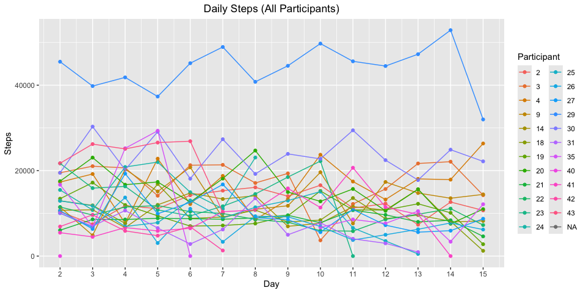<!-- -->

### 2.1.2 Controls

<p style="font-size:20px;">
Controls, Week 1,
</p>

``` r
ggplot(
  data = filter(activity_clean, Day >= 2 & Day <= 8,Stage == "Control"),
  aes(x = Day, y = Steps, color = factor(Participant.ID))
) +
  geom_point() +
  geom_line() +
  scale_x_continuous(breaks = 2:8) +
  theme(
    plot.title = element_text(hjust = 0.5),
    strip.text = element_blank()
  ) +
  labs(
    title = "Daily Steps (Control,Week 1)",
    x = "Day",
    y = "Steps",
    color = "Control"
  )
```

    ## Warning: Removed 1 row containing missing values or values outside the scale range
    ## (`geom_point()`).

    ## Warning: Removed 1 row containing missing values or values outside the scale range
    ## (`geom_line()`).

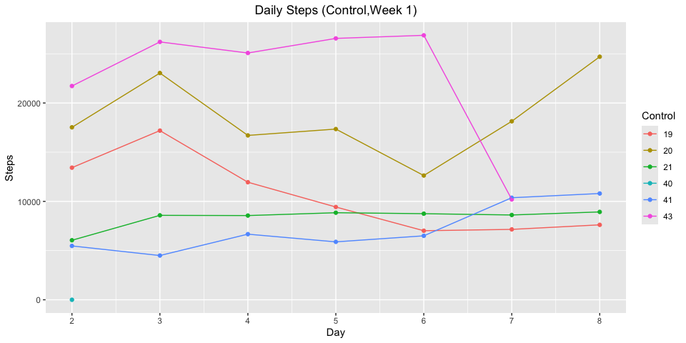<!-- -->

<p style="font-size:20px;">
Controls, Week 2
</p>

``` r
ggplot(
  data = filter(activity_clean, Day >= 9 & Day <= 15,Stage == "Control"),
  aes(x = Day, y = Steps, color = factor(Participant.ID))
) +
  geom_point() +
  geom_line() +
  scale_x_continuous(breaks = 9:15) +
  theme(
    plot.title = element_text(hjust = 0.5),
    strip.text = element_blank()
  ) +
  labs(
    title = "Daily Steps (Control,Week 2)",
    x = "Day",
    y = "Steps",
    color = "Control"
  )
```

    ## Warning: Removed 1 row containing missing values or values outside the scale range
    ## (`geom_point()`).

    ## Warning: Removed 1 row containing missing values or values outside the scale range
    ## (`geom_line()`).

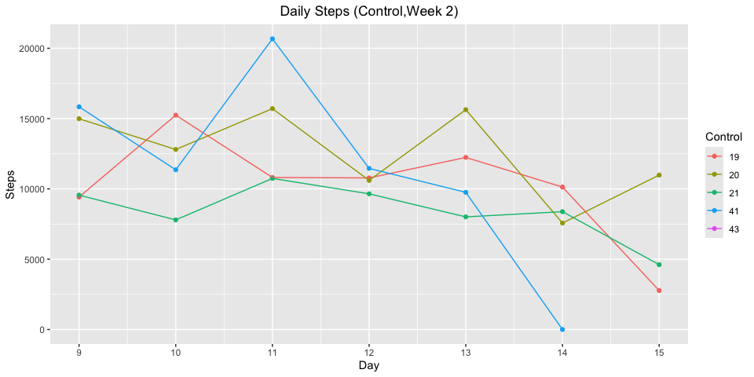<!-- -->

### 2.1.3 HD2

<p style="font-size:20px;">
HD2, Week 1
</p>

``` r
ggplot(
  data = filter(activity_clean, Day >= 2 & Day <= 8,Stage == "Stage 2"),
  aes(x = Day, y = Steps, color = factor(Participant.ID))
) +
  geom_point() +
  geom_line() +
  scale_x_continuous(breaks = 2:8) +
  theme(
    plot.title = element_text(hjust = 0.5),
    strip.text = element_blank()
  ) +
  
  labs(
    title = "Daily Steps (HD2, Week 1)",
    x = "Day",
    y = "Steps",
    color = " HD2"
  )
```

    ## Warning: Removed 1 row containing missing values or values outside the scale range
    ## (`geom_point()`).

    ## Warning: Removed 1 row containing missing values or values outside the scale range
    ## (`geom_line()`).

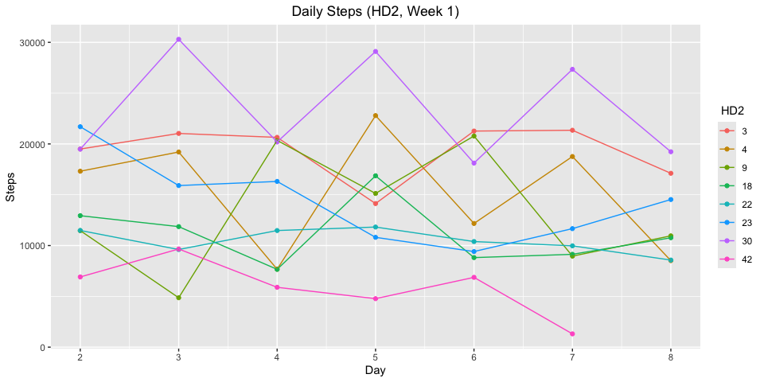<!-- -->

<p style="font-size:20px;">
HD2,Week 2
</p>

``` r
ggplot(
  data = filter(activity_clean, Day >= 9 & Day <= 15,Stage == "Stage 2"),
  aes(x = Day, y = Steps, color = factor(Participant.ID))
) +
  geom_point() +
  geom_line() +
  scale_x_continuous(breaks = 9:15) +
  theme(
    plot.title = element_text(hjust = 0.5),
    strip.text = element_blank()
  ) +
  labs(
    title = "Daily Steps (HD2, Week 2)",
    x = "Day",
    y = "Steps",
    color = "HD2"
  )
```

    ## Warning: Removed 1 row containing missing values or values outside the scale range
    ## (`geom_point()`).

    ## Warning: Removed 1 row containing missing values or values outside the scale range
    ## (`geom_line()`).

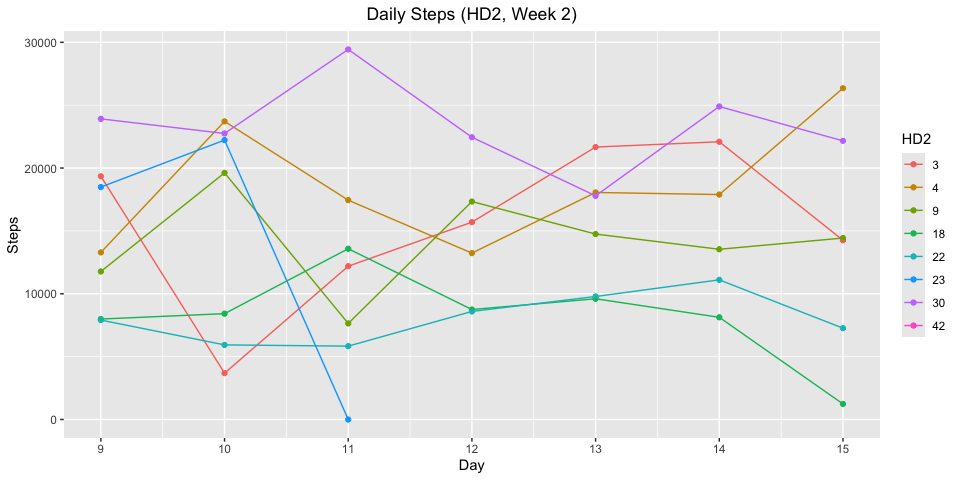<!-- -->

### 2.1.4 HD3

<p style="font-size:20px;">
HD3, Week 1
</p>

``` r
ggplot(
  data = filter(activity_clean, Day >= 2 & Day <= 8,Stage == "Stage 3"),
  aes(x = Day, y = Steps, color = factor(Participant.ID))
) +
  geom_point() +
  geom_line() +
  scale_x_continuous(breaks = 2:8) +
  theme(
    plot.title = element_text(hjust = 0.5),
    strip.text = element_blank()
  ) +
  labs(
    title = "Daily Steps (HD3,Week 1 )",
    x = "Day",
    y = "Steps",
    color = "HD3"
  )
```

    ## Warning: Removed 2 rows containing missing values or values outside the scale range
    ## (`geom_point()`).

    ## Warning: Removed 2 rows containing missing values or values outside the scale range
    ## (`geom_line()`).

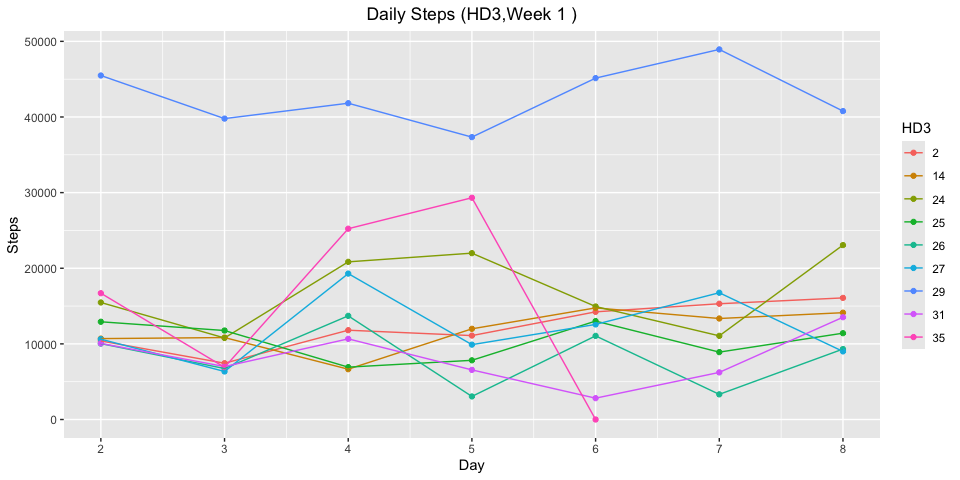<!-- -->
<p style="font-size:20px;">
HD3, Week 2
</p>

``` r
ggplot(
  data = filter(activity_clean, Day >= 9 & Day <= 15,Stage == "Stage 3"),
  aes(x = Day, y = Steps, color = factor(Participant.ID))
) +
  geom_point() +
  geom_line() +
  scale_x_continuous(breaks = 9:15) +
  theme(
    plot.title = element_text(hjust = 0.5),
    strip.text = element_blank()
  ) +
  labs(
    title = "Daily Steps (HD3,Week 2 )",
    x = "Day",
    y = "Steps",
    color = "HD3"
  )
```

    ## Warning: Removed 1 row containing missing values or values outside the scale range
    ## (`geom_point()`).

    ## Warning: Removed 1 row containing missing values or values outside the scale range
    ## (`geom_line()`).

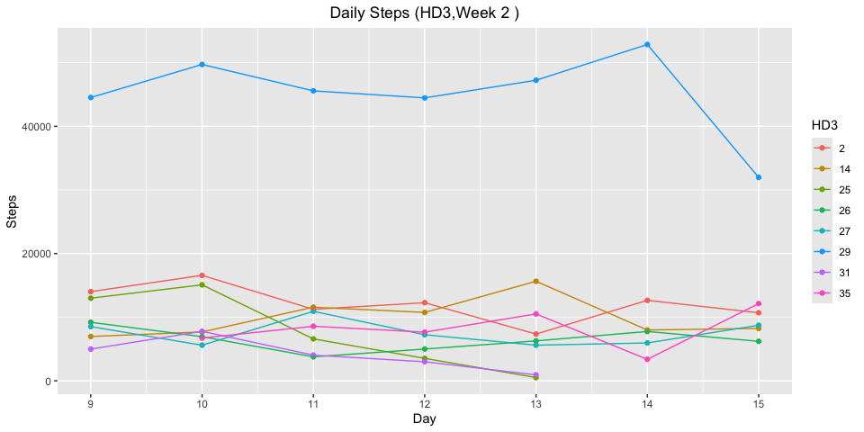<!-- -->

## 2.2 Violin Plots

<p style="font-size:20px;">
Violin plot with embedded an boxplot showing the distribution of daily
steps by group. Wider sections of the violin indicate higher density of
observations at that step count.
</p>

``` r
# Violin plot
activity_clean %>%
  ggplot(aes(x = Stage, y = Steps, fill = Stage)) +
  geom_violin(trim = FALSE, alpha = 0.6) +     # violin shape
  geom_boxplot(width = 0.1, fill = "white", alpha = 0.8, outlier.shape = NA) + # box inside
  scale_x_discrete(labels = c("Stage 2" = "HD2", "Stage 3" = "HD3")) +
  theme_minimal() +
  theme(
    plot.title = element_text(hjust = 0.5),
    legend.position = "none"
  ) +
  labs(
    title = "Distribution of Daily Steps by Stage",
    x = "Stage",
    y = "Steps"
  )
```

    ## Warning: Removed 21 rows containing non-finite outside the scale range
    ## (`stat_ydensity()`).

    ## Warning: Removed 21 rows containing non-finite outside the scale range
    ## (`stat_boxplot()`).

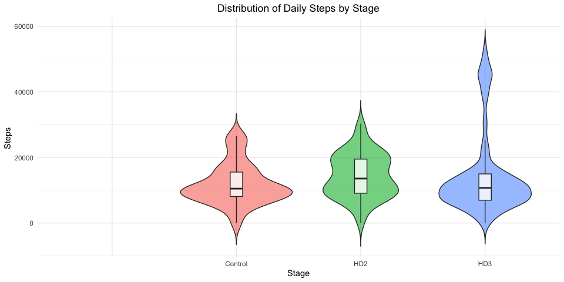<!-- -->

## 2.3 Box Plots

<p style="font-size:20px;">
Another visualization of the daily step distribution by Stage. Outliers
are represented as dot (weeks are combined)
</p>

``` r
activity_clean %>%
  ggplot(aes(x = Stage, y = Steps, fill = Stage)) +
  geom_boxplot(alpha = 0.7) + # includes outlier dots
  scale_x_discrete(labels = c("Stage 2" = "HD2", "Stage 3" = "HD3")) +
  theme_minimal() +
  theme(
    plot.title = element_text(hjust = 0.5),
    legend.position = "none"
  ) +
  labs(
    title = "Daily Steps",
    x = "Stage",
    y = "Steps"
  )  
```

    ## Warning: Removed 21 rows containing non-finite outside the scale range
    ## (`stat_boxplot()`).

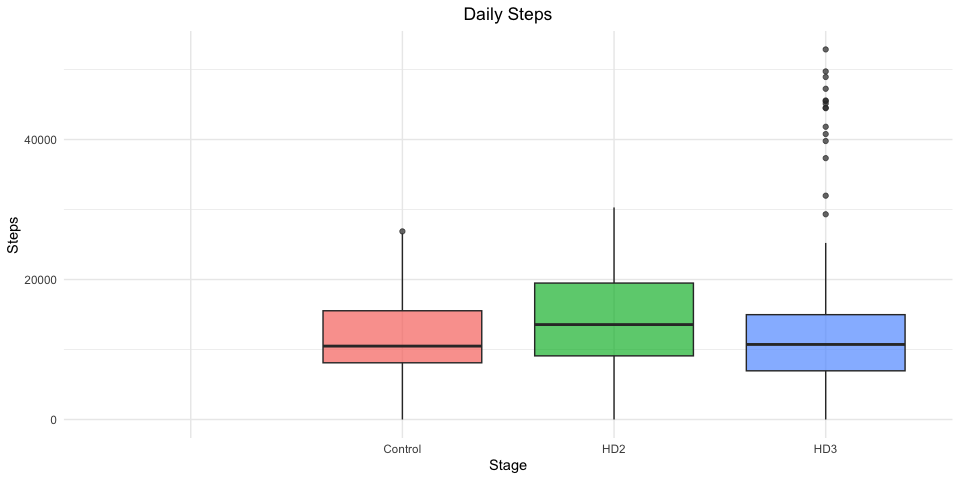<!-- -->

``` r
### Overwrite activity summary for further analysis ###
# group data by Participant, Stage, and Week to calculate each participant's
# average daily counts per activity intensity within each week 
# then percentages ar computed so that the four intensities sum to 100% per week 
activity_summary <- activity_clean %>%
  group_by(Participant.ID, Stage, Week) %>%
  select(Stage, Week, Day, Sedentary, Light, Moderate, Vigorous) %>%
  pivot_longer(cols = c(Sedentary, Light, Moderate, Vigorous),
               names_to = "Activity",
               values_to = "Count") %>%
  group_by(Participant.ID, Stage, Week, Activity) %>%
  summarise(Average = mean(Count, na.rm = TRUE), .groups = "drop") %>%
  group_by(Participant.ID, Stage, Week) %>%
  mutate(
    Percent  = round(Average / sum(Average) * 100, 1),
    Activity = factor(Activity, levels = c("Sedentary", "Light", "Moderate", "Vigorous"))
  ) %>%
  ungroup()
```

## 2.4 Activity Distribution (Stacked Bar Charts)

### 2.4.1 HD3

<p style="font-size:20px;">
HD3 Activity Distribution
</p>

``` r
#First plot is a stacked bar chart showing the average percentage of time spent in each activity
# intensity level  for HD Stage 3 participants broken down by participant and  by week 
# Each bar represents one participant and sums to 100%
# Percentage labels are displayed within each bar segment when the value is >= 2% to avoid overcrowding
activity_summary %>%
  filter(Stage == "Stage 3") %>%
  mutate(
    Activity = factor(Activity, levels = c("Sedentary", "Light", "Moderate", "Vigorous"))
  ) %>%
  ggplot(aes(x = factor(Participant.ID), y = Percent, fill = Activity)) +

  geom_bar(stat = "identity") +

  geom_text(
    aes(label = ifelse(Percent >= 2, paste0(Percent, "%"), "")),
    position = position_stack(vjust = 0.5),
    size = 3,
    color = "white",
    fontface = "bold"
  ) +

  scale_fill_manual(values = c(
    "Sedentary" = "#00FF00",
    "Light"     = "#FFD700",
    "Moderate"  = "#FF6EB4",
    "Vigorous"  = "#8da0cb"
  )) +

  facet_wrap(~ Week, ncol = 1,
             labeller = labeller(Week = c("Week1" = "Week 1", "Week2" = "Week 2"))) +

  labs(
    title = "Average Activity Distribution (Stage 3)",
    x = "HD3",
    y = "Percentage (%)",
    fill = "Activity Level"
  ) +

  theme_minimal() +
  theme(
    plot.title = element_text(hjust = 0.5, face = "bold"),
    axis.text.x = element_text(angle = 30, hjust = 1),
    legend.position = "bottom",
    strip.text = element_text(face = "bold", size = 11),
      
 panel.background = element_rect(fill = "white", color = NA),
 plot.background  = element_rect(fill = "white", color = NA)
 )
ggsave(
  filename = "/Users/jade/Downloads/Mend storage/HD3_activity.png",
  width = 8,
  height = 10,
  dpi = 300
  )
```

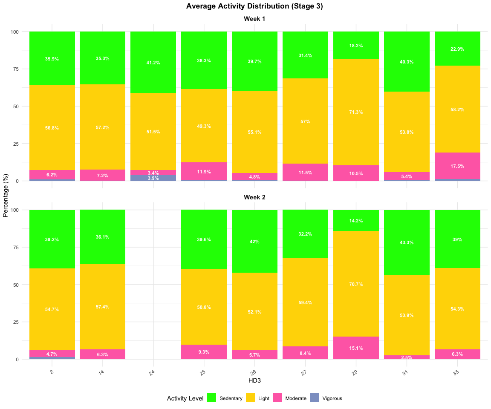<!-- -->

### 2.4.2 HD2

<p style="font-size:20px;">
HD2 Activity Distribution
</p>

``` r
activity_summary %>%
  filter(Stage == "Stage 2") %>%
  mutate(
    Activity = factor(Activity, levels = c("Sedentary", "Light", "Moderate", "Vigorous"))
  ) %>%
  ggplot(aes(x = factor(Participant.ID), y = Percent, fill = Activity)) +

  geom_bar(stat = "identity") +

  geom_text(
    aes(label = ifelse(Percent >= 2, paste0(Percent, "%"), "")),
    position = position_stack(vjust = 0.5),
    size = 3,
    color = "white",
    fontface = "bold"
  ) +

  scale_fill_manual(values = c(
    "Sedentary" = "#00FF00",
    "Light"     = "#FFD700",
    "Moderate"  = "#FF6EB4",
    "Vigorous"  = "#8da0cb"
  )) +

  facet_wrap(~ Week, ncol = 1,
             labeller = labeller(Week = c("Week1" = "Week 1", "Week2" = "Week 2"))) +

  labs(
    title = "Average Activity Distribution (Stage 2)",
    x = "HD2",
    y = "Percentage (%)",
    fill = "Activity Level"
  ) +

  theme_minimal() +
  theme(
    plot.title = element_text(hjust = 0.5, face = "bold"),
    axis.text.x = element_text(angle = 30, hjust = 1),
    legend.position = "bottom",
    strip.text = element_text(face = "bold", size = 11),
      
 panel.background = element_rect(fill = "white", color = NA),
 plot.background  = element_rect(fill = "white", color = NA)
 )
```

    ## Warning: Removed 4 rows containing missing values or values outside the scale range
    ## (`geom_bar()`).

    ## Warning: Removed 4 rows containing missing values or values outside the scale range
    ## (`geom_text()`).

``` r
ggsave(
  filename = "/Users/jade/Downloads/Mend storage/HD2_activity.png",
  width = 8,
  height = 10,
  dpi = 300
  )
```

    ## Warning: Removed 4 rows containing missing values or values outside the scale range
    ## (`geom_bar()`).
    ## Removed 4 rows containing missing values or values outside the scale range
    ## (`geom_text()`).

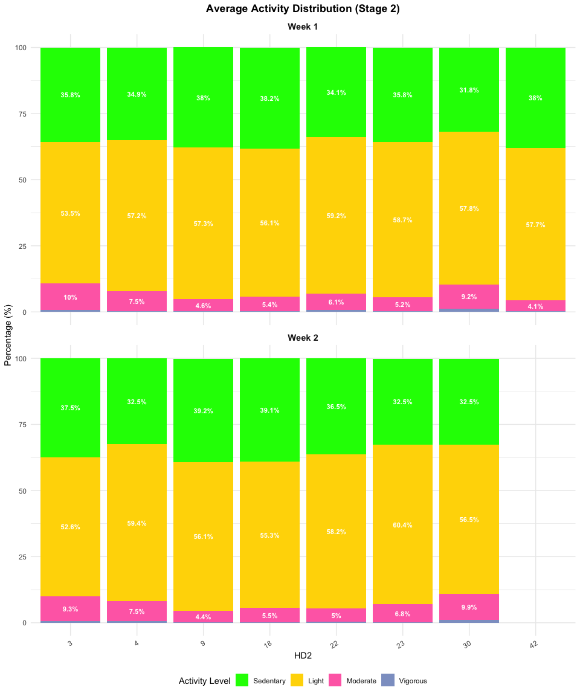<!-- -->

### 2.4.3 Controls

<p style="font-size:20px;">
Control Activity Distribution
</p>

``` r
activity_summary %>%
  filter(Stage == "Control") %>%
  mutate(
    Activity = factor(Activity, levels = c("Sedentary", "Light", "Moderate", "Vigorous"))
  ) %>%
  ggplot(aes(x = factor(Participant.ID), y = Percent, fill = Activity)) +

  geom_bar(stat = "identity") +

  geom_text(
    aes(label = ifelse(Percent >= 2, paste0(Percent, "%"), "")),
    position = position_stack(vjust = 0.5),
    size = 3,
    color = "white",
    fontface = "bold"
  ) +

  scale_fill_manual(values = c(
    "Sedentary" = "#00FF00",
    "Light"     = "#FFD700",
    "Moderate"  = "#FF6EB4",
    "Vigorous"  = "#8da0cb"
  )) +

  facet_wrap(~ Week, ncol = 1,
             labeller = labeller(Week = c("Week1" = "Week 1", "Week2" = "Week 2"))) +

  labs(
    title = "Average Activity Distribution (Control)",
    x = "Control",
    y = "Percentage (%)",
    fill = "Activity Level"
  ) +

  theme_minimal() +
  theme(
    plot.title = element_text(hjust = 0.5, face = "bold"),
    axis.text.x = element_text(angle = 30, hjust = 1),
    legend.position = "bottom",
    strip.text = element_text(face = "bold", size = 11),
  
 panel.background = element_rect(fill = "white", color = NA),
 plot.background  = element_rect(fill = "white", color = NA)
 )
```

    ## Warning: Removed 4 rows containing missing values or values outside the scale range
    ## (`geom_bar()`).

    ## Warning: Removed 4 rows containing missing values or values outside the scale range
    ## (`geom_text()`).

``` r
ggsave(
  filename = "/Users/jade/Downloads/Mend storage/control_activity.png",
  width = 8,
  height = 10,
  dpi = 300
)
```

    ## Warning: Removed 4 rows containing missing values or values outside the scale range
    ## (`geom_bar()`).
    ## Removed 4 rows containing missing values or values outside the scale range
    ## (`geom_text()`).

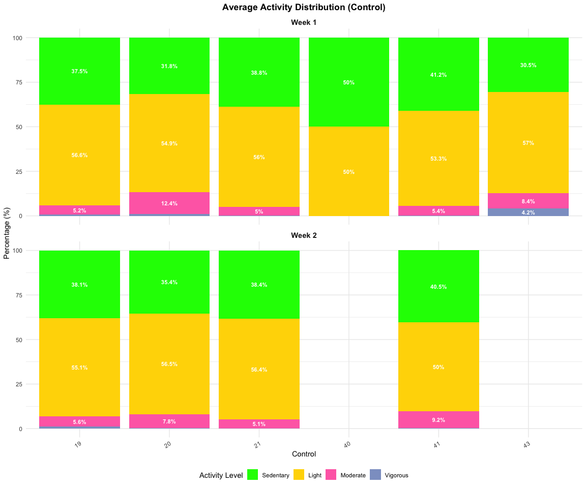<!-- -->

# 3. Statistical Analyses

## 3.1 Within-Group Paired T-Test for Steps and Activity Distrubition

<p style="font-size:20px;">
Paired two-tailed t-tests to assess whether average steps and activity
intensity percentages significantly changed between Week 1 and Week 2
within each participant group
</p>

``` r
### Prepare and run t tests within group ####

# Create week_mean objects. Get the amount of activity at each level and steps 
# for week 1 and week 2

week_mean <- activity_clean %>%
  group_by(Participant.ID, Stage, Week) %>%
  summarise(
   Steps =mean(Steps, na.rm = TRUE),
    .groups = "drop"
  ) %>%
  left_join(
    activity_summary %>%
      select(Participant.ID, Stage, Week, Activity, Percent) %>%
      pivot_wider(names_from = Activity, values_from = Percent),
    by = c("Participant.ID", "Stage", "Week")
  ) %>%
  pivot_wider(
    names_from  = Week,
    values_from = c(Steps, Sedentary, Light, Moderate, Vigorous)
  )

#### Split Data ####

week_mean_control <- week_mean %>% filter(Stage == "Control")
week_mean_HD2     <- week_mean %>% filter(Stage == "Stage 2")
week_mean_HD3     <- week_mean %>% filter(Stage == "Stage 3")

#### Create a function to run t tests ####

run_ttests <- function(week_mean_df) {
  vars <- c("Steps", "Sedentary", "Light", "Moderate", "Vigorous")
  results <- lapply(vars, function(var) {
    t.test(
      x = week_mean_df[[paste0(var, "_Week1")]],
      y = week_mean_df[[paste0(var, "_Week2")]],
      paired = TRUE,
      alternative = "two.sided"
    )
  })
  names(results) <- vars
  return(results)
}
#### Run t tests #####

ttests_HD2     <- run_ttests(week_mean_HD2)
ttests_HD3     <- run_ttests(week_mean_HD3)
ttests_control <- run_ttests(week_mean_control)
```

### 3.1.1 (Table) Within-Group Paired T-Test Plot

``` r
#### Make tables ####

make_combined_table <- function(ttest_list, week_mean_df, title) {
  vars <- c("Steps", "Sedentary", "Light", "Moderate", "Vigorous")
  
  data.frame(
    "Variable"    = vars,
    "Week 1 Mean" = sapply(vars, function(v) round(mean(week_mean_df[[paste0(v, "_Week1")]], na.rm = TRUE), 2)),
    "Week 2 Mean" = sapply(vars, function(v) round(mean(week_mean_df[[paste0(v, "_Week2")]], na.rm = TRUE), 2)),
    "t"           = sapply(vars, function(v) round(ttest_list[[v]]$statistic, 3)),
    "df"          = sapply(vars, function(v) round(ttest_list[[v]]$parameter, 3)),
    "p-value"     = sapply(vars, function(v) round(ttest_list[[v]]$p.value, 3)),
    check.names   = FALSE
    
    
  ) %>%
knitr::kable(
  caption = paste0(
    "<div style='text-align:center;color:black;'><b>",
    title,
    "</b></div>"
  ),
  align = c("c", "c", "c", "c", "c", "c"),
  row.names = FALSE
) %>%
  kable_styling(
    bootstrap_options = "basic",
    full_width = FALSE,
    position = "center"
  ) %>%
  row_spec(0, bold = TRUE)

}
make_combined_table(ttests_HD2, week_mean_HD2, "Paired T-test: HD Stage 2") 
```

<table class="table" style="width: auto !important; margin-left: auto; margin-right: auto;">
<caption>

<div style="text-align:center;color:black;">

<b>Paired T-test: HD Stage 2</b>

</div>

</caption>
<thead>
<tr>
<th style="text-align:center;font-weight: bold;">
Variable
</th>
<th style="text-align:center;font-weight: bold;">
Week 1 Mean
</th>
<th style="text-align:center;font-weight: bold;">
Week 2 Mean
</th>
<th style="text-align:center;font-weight: bold;">
t
</th>
<th style="text-align:center;font-weight: bold;">
df
</th>
<th style="text-align:center;font-weight: bold;">
p-value
</th>
</tr>
</thead>
<tbody>
<tr>
<td style="text-align:center;">
Steps
</td>
<td style="text-align:center;">
14120.22
</td>
<td style="text-align:center;">
14501.49
</td>
<td style="text-align:center;">
0.850
</td>
<td style="text-align:center;">
6
</td>
<td style="text-align:center;">
0.428
</td>
</tr>
<tr>
<td style="text-align:center;">
Sedentary
</td>
<td style="text-align:center;">
35.83
</td>
<td style="text-align:center;">
35.69
</td>
<td style="text-align:center;">
-0.211
</td>
<td style="text-align:center;">
6
</td>
<td style="text-align:center;">
0.840
</td>
</tr>
<tr>
<td style="text-align:center;">
Light
</td>
<td style="text-align:center;">
57.19
</td>
<td style="text-align:center;">
56.93
</td>
<td style="text-align:center;">
0.333
</td>
<td style="text-align:center;">
6
</td>
<td style="text-align:center;">
0.751
</td>
</tr>
<tr>
<td style="text-align:center;">
Moderate
</td>
<td style="text-align:center;">
6.51
</td>
<td style="text-align:center;">
6.91
</td>
<td style="text-align:center;">
-0.169
</td>
<td style="text-align:center;">
6
</td>
<td style="text-align:center;">
0.871
</td>
</tr>
<tr>
<td style="text-align:center;">
Vigorous
</td>
<td style="text-align:center;">
0.49
</td>
<td style="text-align:center;">
0.46
</td>
<td style="text-align:center;">
0.956
</td>
<td style="text-align:center;">
6
</td>
<td style="text-align:center;">
0.376
</td>
</tr>
</tbody>
</table>

``` r
make_combined_table(ttests_HD3, week_mean_HD3, "Paired T-test: HD Stage 3")
```

<table class="table" style="width: auto !important; margin-left: auto; margin-right: auto;">
<caption>

<div style="text-align:center;color:black;">

<b>Paired T-test: HD Stage 3</b>

</div>

</caption>
<thead>
<tr>
<th style="text-align:center;font-weight: bold;">
Variable
</th>
<th style="text-align:center;font-weight: bold;">
Week 1 Mean
</th>
<th style="text-align:center;font-weight: bold;">
Week 2 Mean
</th>
<th style="text-align:center;font-weight: bold;">
t
</th>
<th style="text-align:center;font-weight: bold;">
df
</th>
<th style="text-align:center;font-weight: bold;">
p-value
</th>
</tr>
</thead>
<tbody>
<tr>
<td style="text-align:center;">
Steps
</td>
<td style="text-align:center;">
15350.16
</td>
<td style="text-align:center;">
12642.55
</td>
<td style="text-align:center;">
2.396
</td>
<td style="text-align:center;">
7
</td>
<td style="text-align:center;">
0.048
</td>
</tr>
<tr>
<td style="text-align:center;">
Sedentary
</td>
<td style="text-align:center;">
33.69
</td>
<td style="text-align:center;">
35.70
</td>
<td style="text-align:center;">
-1.444
</td>
<td style="text-align:center;">
7
</td>
<td style="text-align:center;">
0.192
</td>
</tr>
<tr>
<td style="text-align:center;">
Light
</td>
<td style="text-align:center;">
56.69
</td>
<td style="text-align:center;">
56.66
</td>
<td style="text-align:center;">
0.874
</td>
<td style="text-align:center;">
7
</td>
<td style="text-align:center;">
0.411
</td>
</tr>
<tr>
<td style="text-align:center;">
Moderate
</td>
<td style="text-align:center;">
8.71
</td>
<td style="text-align:center;">
7.29
</td>
<td style="text-align:center;">
1.318
</td>
<td style="text-align:center;">
7
</td>
<td style="text-align:center;">
0.229
</td>
</tr>
<tr>
<td style="text-align:center;">
Vigorous
</td>
<td style="text-align:center;">
0.91
</td>
<td style="text-align:center;">
0.38
</td>
<td style="text-align:center;">
1.171
</td>
<td style="text-align:center;">
7
</td>
<td style="text-align:center;">
0.280
</td>
</tr>
</tbody>
</table>

``` r
make_combined_table(ttests_control, week_mean_control, "Paired T-test: Controls")
```

<table class="table" style="width: auto !important; margin-left: auto; margin-right: auto;">
<caption>

<div style="text-align:center;color:black;">

<b>Paired T-test: Controls</b>

</div>

</caption>
<thead>
<tr>
<th style="text-align:center;font-weight: bold;">
Variable
</th>
<th style="text-align:center;font-weight: bold;">
Week 1 Mean
</th>
<th style="text-align:center;font-weight: bold;">
Week 2 Mean
</th>
<th style="text-align:center;font-weight: bold;">
t
</th>
<th style="text-align:center;font-weight: bold;">
df
</th>
<th style="text-align:center;font-weight: bold;">
p-value
</th>
</tr>
</thead>
<tbody>
<tr>
<td style="text-align:center;">
Steps
</td>
<td style="text-align:center;">
11234.90
</td>
<td style="text-align:center;">
10679.31
</td>
<td style="text-align:center;">
0.226
</td>
<td style="text-align:center;">
3
</td>
<td style="text-align:center;">
0.836
</td>
</tr>
<tr>
<td style="text-align:center;">
Sedentary
</td>
<td style="text-align:center;">
38.30
</td>
<td style="text-align:center;">
38.10
</td>
<td style="text-align:center;">
-0.789
</td>
<td style="text-align:center;">
3
</td>
<td style="text-align:center;">
0.488
</td>
</tr>
<tr>
<td style="text-align:center;">
Light
</td>
<td style="text-align:center;">
54.63
</td>
<td style="text-align:center;">
54.50
</td>
<td style="text-align:center;">
0.650
</td>
<td style="text-align:center;">
3
</td>
<td style="text-align:center;">
0.562
</td>
</tr>
<tr>
<td style="text-align:center;">
Moderate
</td>
<td style="text-align:center;">
6.07
</td>
<td style="text-align:center;">
6.92
</td>
<td style="text-align:center;">
0.043
</td>
<td style="text-align:center;">
3
</td>
<td style="text-align:center;">
0.968
</td>
</tr>
<tr>
<td style="text-align:center;">
Vigorous
</td>
<td style="text-align:center;">
1.02
</td>
<td style="text-align:center;">
0.50
</td>
<td style="text-align:center;">
-0.095
</td>
<td style="text-align:center;">
3
</td>
<td style="text-align:center;">
0.930
</td>
</tr>
</tbody>
</table>

### 3.1.2 (Plot) Within-Group Paired T-Test Plot (Steps)

<p style="font-size:20px;">
Distribution of mean daily step counts across Week 1 and Week 2 within
each participant group
</p>

``` r
week_mean %>%
  pivot_longer(
    cols = c(Steps_Week1, Steps_Week2),
    names_to = "Week",
    values_to = "Steps"
  ) %>%
  mutate(Week = recode(Week, "Steps_Week1" = "Week 1", "Steps_Week2" = "Week 2")) %>%
  ggplot(aes(x = Stage, y = Steps, fill = Week)) +
  geom_boxplot(alpha = 0.7) +
  scale_x_discrete(labels = c("Stage 2" = "HD2", "Stage 3" = "HD3", "Control" = "Control")) +
  theme_minimal() +
  theme(
    plot.title = element_text(hjust = 0.5, face = "bold"),
    legend.position = "bottom"
  ) +
  labs(
    title = "Within-Group Paired T-Tests: Mean Daily Steps",
    x = "",
    y = "Steps",
    fill = ""
  )
```

    ## Warning: Removed 6 rows containing non-finite outside the scale range
    ## (`stat_boxplot()`).

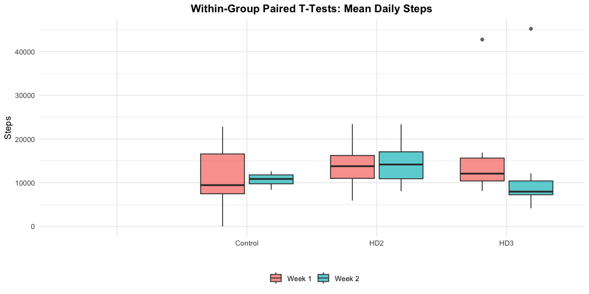<!-- -->

## 3.2 Between-Group T-Test

<p style="font-size:20px;">
Two-tailed t-tests to compare PA measures between HD groups and controls
</p>

``` r
run_between_ttests <- function(df_group1, df_group2) {
  vars <- c("Steps", "Sedentary", "Light", "Moderate", "Vigorous")
  results <- lapply(vars, function(var) {
    t.test(
      x = df_group1[[paste0(var, "_Week1")]],
      y = df_group2[[paste0(var, "_Week1")]],
      paired = FALSE,              # <- independent samples 
      alternative = "two.sided"
    )
  })
  names(results) <- vars
  return(results)
}

#### Run between group t tests ####
ttests_HD2_vs_control <- run_between_ttests(week_mean_HD2, week_mean_control)
ttests_HD3_vs_control <- run_between_ttests(week_mean_HD3, week_mean_control)
```

### 3.2.1 (Table) Between-Group T-Test

``` r
make_between_table <- function(ttest_list, df_group1, df_group2, title, hd_label) {
  vars <- c("Steps", "Sedentary", "Light", "Moderate", "Vigorous")
  
  overall_mean <- function(df, v) {
    round(mean(c(df[[paste0(v, "_Week1")]], 
                 df[[paste0(v, "_Week2")]]), 
               na.rm = TRUE), 2)
  }
  

  df <- data.frame(
    "Variable"     = vars,
    "HD_Mean"      = sapply(vars, function(v) overall_mean(df_group1, v)),  # fixed
    "Control Mean" = sapply(vars, function(v) overall_mean(df_group2, v)),  # fixed
    "t"            = sapply(vars, function(v) round(ttest_list[[v]]$statistic, 3)),
    "df"           = sapply(vars, function(v) round(ttest_list[[v]]$parameter, 3)),
    "p-value"      = sapply(vars, function(v) round(ttest_list[[v]]$p.value, 3)),
    check.names    = FALSE
  )
  

  names(df)[names(df) == "HD_Mean"] <- hd_label
  
 
  df %>%
  knitr::kable(
    caption = paste0(
      "<div style='text-align:center;color:black;'><b>",
      title,
      "</b></div>"
    ),
    escape = FALSE,
    align = c("c", "c", "c", "c", "c", "c"),
    row.names = FALSE
  ) %>%
  kable_styling(
    bootstrap_options = "basic",
    full_width = FALSE,
    position = "center"
  ) %>%
  row_spec(0, bold = TRUE)
}
#### Make between group tables ####
make_between_table(ttests_HD2_vs_control, week_mean_HD2, week_mean_control, "T-test: HD Stage 2 vs Controls", hd_label = "HD2 Mean")
```

<table class="table" style="width: auto !important; margin-left: auto; margin-right: auto;">
<caption>

<div style="text-align:center;color:black;">

<b>T-test: HD Stage 2 vs Controls</b>

</div>

</caption>
<thead>
<tr>
<th style="text-align:center;font-weight: bold;">
Variable
</th>
<th style="text-align:center;font-weight: bold;">
HD2 Mean
</th>
<th style="text-align:center;font-weight: bold;">
Control Mean
</th>
<th style="text-align:center;font-weight: bold;">
t
</th>
<th style="text-align:center;font-weight: bold;">
df
</th>
<th style="text-align:center;font-weight: bold;">
p-value
</th>
</tr>
</thead>
<tbody>
<tr>
<td style="text-align:center;">
Steps
</td>
<td style="text-align:center;">
14298.15
</td>
<td style="text-align:center;">
11012.66
</td>
<td style="text-align:center;">
0.746
</td>
<td style="text-align:center;">
8.147
</td>
<td style="text-align:center;">
0.476
</td>
</tr>
<tr>
<td style="text-align:center;">
Sedentary
</td>
<td style="text-align:center;">
35.76
</td>
<td style="text-align:center;">
38.22
</td>
<td style="text-align:center;">
-0.828
</td>
<td style="text-align:center;">
5.760
</td>
<td style="text-align:center;">
0.441
</td>
</tr>
<tr>
<td style="text-align:center;">
Light
</td>
<td style="text-align:center;">
57.07
</td>
<td style="text-align:center;">
54.58
</td>
<td style="text-align:center;">
2.056
</td>
<td style="text-align:center;">
8.263
</td>
<td style="text-align:center;">
0.073
</td>
</tr>
<tr>
<td style="text-align:center;">
Moderate
</td>
<td style="text-align:center;">
6.70
</td>
<td style="text-align:center;">
6.41
</td>
<td style="text-align:center;">
0.241
</td>
<td style="text-align:center;">
7.083
</td>
<td style="text-align:center;">
0.816
</td>
</tr>
<tr>
<td style="text-align:center;">
Vigorous
</td>
<td style="text-align:center;">
0.47
</td>
<td style="text-align:center;">
0.81
</td>
<td style="text-align:center;">
-0.791
</td>
<td style="text-align:center;">
5.361
</td>
<td style="text-align:center;">
0.462
</td>
</tr>
</tbody>
</table>

``` r
make_between_table(ttests_HD3_vs_control, week_mean_HD3, week_mean_control, "T-test: HD Stage 3 vs Controls", hd_label = "HD3 Mean")
```

<table class="table" style="width: auto !important; margin-left: auto; margin-right: auto;">
<caption>

<div style="text-align:center;color:black;">

<b>T-test: HD Stage 3 vs Controls</b>

</div>

</caption>
<thead>
<tr>
<th style="text-align:center;font-weight: bold;">
Variable
</th>
<th style="text-align:center;font-weight: bold;">
HD3 Mean
</th>
<th style="text-align:center;font-weight: bold;">
Control Mean
</th>
<th style="text-align:center;font-weight: bold;">
t
</th>
<th style="text-align:center;font-weight: bold;">
df
</th>
<th style="text-align:center;font-weight: bold;">
p-value
</th>
</tr>
</thead>
<tbody>
<tr>
<td style="text-align:center;">
Steps
</td>
<td style="text-align:center;">
14075.99
</td>
<td style="text-align:center;">
11012.66
</td>
<td style="text-align:center;">
0.840
</td>
<td style="text-align:center;">
12.605
</td>
<td style="text-align:center;">
0.416
</td>
</tr>
<tr>
<td style="text-align:center;">
Sedentary
</td>
<td style="text-align:center;">
34.64
</td>
<td style="text-align:center;">
38.22
</td>
<td style="text-align:center;">
-1.167
</td>
<td style="text-align:center;">
11.909
</td>
<td style="text-align:center;">
0.266
</td>
</tr>
<tr>
<td style="text-align:center;">
Light
</td>
<td style="text-align:center;">
56.68
</td>
<td style="text-align:center;">
54.58
</td>
<td style="text-align:center;">
0.881
</td>
<td style="text-align:center;">
11.551
</td>
<td style="text-align:center;">
0.396
</td>
</tr>
<tr>
<td style="text-align:center;">
Moderate
</td>
<td style="text-align:center;">
8.04
</td>
<td style="text-align:center;">
6.41
</td>
<td style="text-align:center;">
1.175
</td>
<td style="text-align:center;">
11.545
</td>
<td style="text-align:center;">
0.264
</td>
</tr>
<tr>
<td style="text-align:center;">
Vigorous
</td>
<td style="text-align:center;">
0.66
</td>
<td style="text-align:center;">
0.81
</td>
<td style="text-align:center;">
-0.137
</td>
<td style="text-align:center;">
8.700
</td>
<td style="text-align:center;">
0.894
</td>
</tr>
</tbody>
</table>

## 3.3 ICC analysis

<p style="font-size:20px;">
Test-retest reliability across Week 1 and Week 2 to evaluate HD and
control groups separately using ICC(2,1) absolute agreement models
</p>

``` r
library(tidyverse)
library(irr)

# Filter valid wear days
activity_clean <- activity_clean %>%
  filter(Wear.Time >= 600) %>%
  mutate(
    Group = ifelse(Stage == "Control", "Control", "HD"),
    day_num = as.numeric(factor(Day.of.Week,
                                levels = c("Monday", "Tuesday", "Wednesday",
                                           "Thursday", "Friday", "Saturday", 
                                           "Sunday")))
  )

#  Keep only days that appear in BOTH weeks 
valid_days <- activity_clean %>%
  group_by(Participant.ID, Day.of.Week) %>%
  filter(n_distinct(Week) == 2) %>%   # must appear in Week 1 AND Week 2
  ungroup()

#  Find longest consecutive run per participant 
valid_days <- valid_days %>%
  arrange(Participant.ID, day_num) %>%
  group_by(Participant.ID, Group) %>%
  mutate(
    # detect when day sequence breaks
    is_consecutive = day_num - lag(day_num, default = first(day_num)) <= 1,
    run_id = cumsum(!is_consecutive),
  ) %>%
  group_by(Participant.ID, Group, run_id) %>%
  mutate(run_length = n_distinct(day_num)) %>%   # count unique days in run
  group_by(Participant.ID, Group) %>%
  filter(run_length == max(run_length)) %>%       # keep longest run
  filter(run_id == min(run_id)) %>%               # break ties: take first run
  ungroup()

#  Pivot wide 
icc_wide <- valid_days %>%
  select(Participant.ID, Group, Day.of.Week, Week,
         Steps, Sedentary, Light, Moderate, Vigorous) %>%
  pivot_wider(
    names_from  = Week,
    values_from = c(Steps, Sedentary, Light, Moderate, Vigorous),
    values_fn   = mean
  ) %>%
  filter(!is.na(Steps_Week1) & !is.na(Steps_Week2))

#  ICC(2,1) by group 
vars <- c("Steps", "Sedentary", "Light", "Moderate", "Vigorous")

run_icc <- function(data, group_name) {
  lapply(vars, function(v) {
    dat <- data[data$Group == group_name, 
                c(paste0(v, "_Week1"), paste0(v, "_Week2"))]
    dat <- dat[complete.cases(dat), ]
    
    result <- irr::icc(
      dat,
      model = "twoway",
      type  = "agreement",
      unit  = "single"    
    )
    
    # return tidy summary
    data.frame(
      Variable  = v,
      Group     = group_name,
      N         = nrow(dat),
      ICC       = round(result$value, 3),
      Lower_CI  = round(result$lbound, 3),
      Upper_CI  = round(result$ubound, 3),
      p_value   = round(result$p.value, 4)
    )
  }) %>% bind_rows()
}
# ── Step 6: Combine and rename ─────────────────────────────────
icc_results <- bind_rows(
  run_icc(icc_wide, "HD"),
  run_icc(icc_wide, "Control")
) %>% 
  rename(
    "95% CI Lower" = Lower_CI,
    "95% CI Upper" = Upper_CI,
    "p-value"      = p_value
  )
# Run for both groups
icc_results %>%
  knitr::kable(
    caption = paste0(
      "<div style='text-align:center;color:black;'><b>",
      "ICC(2,1): PA Test-Retest Reliability <br> ICC(2,1) Results by Group and Variable",
      "</b></div>"
    ),
    escape = FALSE,
    align = c("c", "c", "c", "c", "c", "c", "c"),
    row.names = FALSE
  ) %>%
  kableExtra::kable_styling(
    bootstrap_options = "basic",
    full_width = FALSE,
    position = "center"
  ) %>%
  kableExtra::row_spec(0, bold = TRUE)
```

<table class="table" style="width: auto !important; margin-left: auto; margin-right: auto;">
<caption>

<div style="text-align:center;color:black;">

<b>ICC(2,1): PA Test-Retest Reliability <br> ICC(2,1) Results by Group
and Variable</b>

</div>

</caption>
<thead>
<tr>
<th style="text-align:center;font-weight: bold;">
Variable
</th>
<th style="text-align:center;font-weight: bold;">
Group
</th>
<th style="text-align:center;font-weight: bold;">
N
</th>
<th style="text-align:center;font-weight: bold;">
ICC
</th>
<th style="text-align:center;font-weight: bold;">
95% CI Lower
</th>
<th style="text-align:center;font-weight: bold;">
95% CI Upper
</th>
<th style="text-align:center;font-weight: bold;">
p-value
</th>
</tr>
</thead>
<tbody>
<tr>
<td style="text-align:center;">
Steps
</td>
<td style="text-align:center;">
HD
</td>
<td style="text-align:center;">
77
</td>
<td style="text-align:center;">
0.823
</td>
<td style="text-align:center;">
0.735
</td>
<td style="text-align:center;">
0.884
</td>
<td style="text-align:center;">
0.0000
</td>
</tr>
<tr>
<td style="text-align:center;">
Sedentary
</td>
<td style="text-align:center;">
HD
</td>
<td style="text-align:center;">
77
</td>
<td style="text-align:center;">
0.464
</td>
<td style="text-align:center;">
0.271
</td>
<td style="text-align:center;">
0.622
</td>
<td style="text-align:center;">
0.0000
</td>
</tr>
<tr>
<td style="text-align:center;">
Light
</td>
<td style="text-align:center;">
HD
</td>
<td style="text-align:center;">
77
</td>
<td style="text-align:center;">
0.036
</td>
<td style="text-align:center;">
-0.192
</td>
<td style="text-align:center;">
0.258
</td>
<td style="text-align:center;">
0.3801
</td>
</tr>
<tr>
<td style="text-align:center;">
Moderate
</td>
<td style="text-align:center;">
HD
</td>
<td style="text-align:center;">
77
</td>
<td style="text-align:center;">
0.503
</td>
<td style="text-align:center;">
0.315
</td>
<td style="text-align:center;">
0.653
</td>
<td style="text-align:center;">
0.0000
</td>
</tr>
<tr>
<td style="text-align:center;">
Vigorous
</td>
<td style="text-align:center;">
HD
</td>
<td style="text-align:center;">
77
</td>
<td style="text-align:center;">
0.423
</td>
<td style="text-align:center;">
0.220
</td>
<td style="text-align:center;">
0.591
</td>
<td style="text-align:center;">
0.0001
</td>
</tr>
<tr>
<td style="text-align:center;">
Steps
</td>
<td style="text-align:center;">
Control
</td>
<td style="text-align:center;">
24
</td>
<td style="text-align:center;">
0.221
</td>
<td style="text-align:center;">
-0.197
</td>
<td style="text-align:center;">
0.570
</td>
<td style="text-align:center;">
0.1463
</td>
</tr>
<tr>
<td style="text-align:center;">
Sedentary
</td>
<td style="text-align:center;">
Control
</td>
<td style="text-align:center;">
24
</td>
<td style="text-align:center;">
0.218
</td>
<td style="text-align:center;">
-0.203
</td>
<td style="text-align:center;">
0.568
</td>
<td style="text-align:center;">
0.1512
</td>
</tr>
<tr>
<td style="text-align:center;">
Light
</td>
<td style="text-align:center;">
Control
</td>
<td style="text-align:center;">
24
</td>
<td style="text-align:center;">
-0.161
</td>
<td style="text-align:center;">
-0.518
</td>
<td style="text-align:center;">
0.247
</td>
<td style="text-align:center;">
0.7828
</td>
</tr>
<tr>
<td style="text-align:center;">
Moderate
</td>
<td style="text-align:center;">
Control
</td>
<td style="text-align:center;">
24
</td>
<td style="text-align:center;">
0.461
</td>
<td style="text-align:center;">
0.098
</td>
<td style="text-align:center;">
0.721
</td>
<td style="text-align:center;">
0.0075
</td>
</tr>
<tr>
<td style="text-align:center;">
Vigorous
</td>
<td style="text-align:center;">
Control
</td>
<td style="text-align:center;">
24
</td>
<td style="text-align:center;">
0.497
</td>
<td style="text-align:center;">
0.117
</td>
<td style="text-align:center;">
0.748
</td>
<td style="text-align:center;">
0.0067
</td>
</tr>
</tbody>
</table>

### 3.3.1 Bland–Altman plots

<p style="font-size:20px;">
Visually assess agreement and measurement bias across weeks
</p>

``` r
make_ba_plot <- function(group_filter, var, color) {
  d <- icc_wide %>%
    filter(Group == group_filter) %>%
    select(Participant.ID, Group, 
           paste0(var, "_Week1"), 
           paste0(var, "_Week2")) %>%
    drop_na() %>%
    mutate(
      Mean = (.data[[paste0(var, "_Week1")]] + .data[[paste0(var, "_Week2")]]) / 2,
      Diff =  .data[[paste0(var, "_Week1")]] - .data[[paste0(var, "_Week2")]]
    )

  mean_diff <- mean(d$Diff)
  sd_diff   <- sd(d$Diff)
  loa_upper <- mean_diff + 1.96 * sd_diff
  loa_lower <- mean_diff - 1.96 * sd_diff

  ggplot(d, aes(x = Mean, y = Diff)) +
    geom_point(color = color, alpha = 0.7, size = 2) +
    geom_hline(yintercept = mean_diff, color = "black",  linewidth = 0.8) +
    geom_hline(yintercept = loa_upper, color = "gray40", linewidth = 0.7, linetype = "dashed") +
    geom_hline(yintercept = loa_lower, color = "gray40", linewidth = 0.7, linetype = "dashed") +
    annotate("text", x = Inf, y = loa_upper, 
             label = paste0("+1.96 SD: ", round(loa_upper, 2)),
             hjust = 1.1, vjust = -0.5, size = 5) +
    annotate("text", x = Inf, y = loa_lower, 
             label = paste0("-1.96 SD: ", round(loa_lower, 2)),
             hjust = 1.1, vjust = 1.5, size = 5) +
    annotate("text", x = Inf, y = mean_diff, 
             label = paste0("Bias: ", round(mean_diff, 2)),
             hjust = 1.1, vjust = -0.5, size = 5) +
    scale_y_continuous(expand = expansion(mult = 0.2)) +
    labs(
      title = paste(group_filter, "—", var),
      x     = "Mean (Week 1 & Week 2)", 
      y     = "Difference (Week 1 - Week 2)"
    ) +
    theme_minimal(base_size = 16) +
    theme(plot.title = element_text(face = "bold", hjust = 0.5))
}

# ── Call for each variable and group ──────────────────────────
ba1 <- make_ba_plot("HD",      "Steps",     "#2166AC")
ba2 <- make_ba_plot("HD",      "Sedentary", "#2166AC")
ba3 <- make_ba_plot("HD",      "Light",     "#2166AC")
ba4 <- make_ba_plot("HD",      "Moderate",  "#2166AC")
ba5 <- make_ba_plot("HD",      "Vigorous",  "#2166AC")

ba6  <- make_ba_plot("Control", "Steps",     "#D6604D")
ba7  <- make_ba_plot("Control", "Sedentary", "#D6604D")
ba8  <- make_ba_plot("Control", "Light",     "#D6604D")
ba9  <- make_ba_plot("Control", "Moderate",  "#D6604D")
ba10 <- make_ba_plot("Control", "Vigorous",  "#D6604D")
library(patchwork)
p <- (ba1 | ba2 | ba3 | ba4 | ba5) /
     (ba6 | ba7 | ba8 | ba9 | ba10)+
plot_annotation(
    title = "ICC Bland-Altman Plots: PA Variables",
    theme = theme(
      plot.title = element_text(hjust = 0.5, face = "bold", size = 26)
    )
  )
p
```

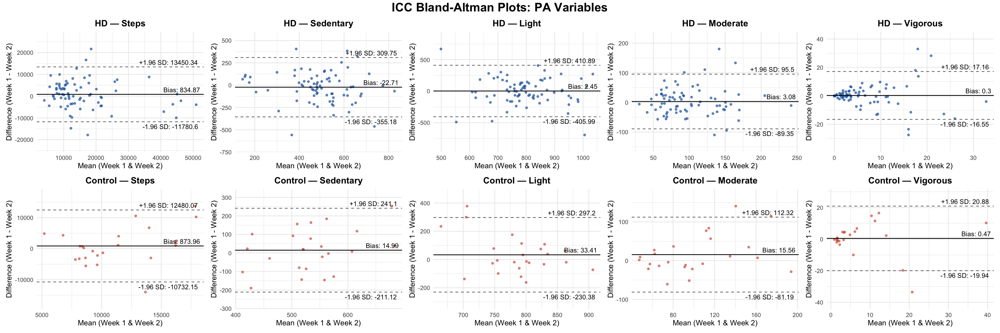<!-- --> \#
3.4 Minimal Detectable Chance (MDC) and Standard Error of Measurement
(SEM)
<p style="font-size:20px;">
SEM and MDC were calculated from ICC values to measure reliability and
determine the smallest real change beyond measurement error within each
group
</p>

``` r
run_mdc <- function(group_filter, var) {
  d <- icc_wide %>%
    filter(Group == group_filter) %>%
    select(Participant.ID, Group,
           paste0(var, "_Week1"),
           paste0(var, "_Week2")) %>%
    drop_na()

  icc_val    <- icc_results %>% filter(Variable == var, Group == group_filter) %>% pull(ICC)
  all_vals   <- c(d[[paste0(var, "_Week1")]], d[[paste0(var, "_Week2")]])
  sd_pooled  <- sd(all_vals, na.rm = TRUE)
  sem        <- sd_pooled * sqrt(1 - icc_val)
  mdc        <- sem * 1.96 * sqrt(2)
  grand_mean <- mean(all_vals, na.rm = TRUE)
  mdc_pct    <- (mdc / grand_mean) * 100

  tibble(
    Variable     = var,
    Group        = group_filter,
    `Grand Mean` = round(grand_mean, 3),
    SEM          = round(sem, 3),
    MDC          = round(mdc, 3),
    `MDC%`       = round(mdc_pct, 1)
  )
}

mdc_rows  <- lapply(c("HD", "Control"), function(grp) lapply(vars, function(var) run_mdc(grp, var)))
table_mdc <- bind_rows(unlist(mdc_rows, recursive = FALSE))

table_mdc %>%
  knitr::kable(
    caption = paste0(
      "<div style='text-align:center;color:black;'><b>",
      "Minimal Detectable Change (MDC) <br> MDC Results by Group and Variable",
      "</b></div>"
    ),
    escape    = FALSE,
    align     = c("c", "c", "c", "c", "c", "c"),
    row.names = FALSE
  ) %>%
  kableExtra::kable_styling(
    bootstrap_options = "basic",
    full_width        = FALSE,
    position          = "center"
  ) %>%
  kableExtra::row_spec(0, bold = TRUE)
```

<table class="table" style="width: auto !important; margin-left: auto; margin-right: auto;">
<caption>

<div style="text-align:center;color:black;">

<b>Minimal Detectable Change (MDC) <br> MDC Results by Group and
Variable</b>

</div>

</caption>
<thead>
<tr>
<th style="text-align:center;font-weight: bold;">
Variable
</th>
<th style="text-align:center;font-weight: bold;">
Group
</th>
<th style="text-align:center;font-weight: bold;">
Grand Mean
</th>
<th style="text-align:center;font-weight: bold;">
SEM
</th>
<th style="text-align:center;font-weight: bold;">
MDC
</th>
<th style="text-align:center;font-weight: bold;">
MDC%
</th>
</tr>
</thead>
<tbody>
<tr>
<td style="text-align:center;">
Steps
</td>
<td style="text-align:center;">
HD
</td>
<td style="text-align:center;">
16018.877
</td>
<td style="text-align:center;">
4545.929
</td>
<td style="text-align:center;">
12600.673
</td>
<td style="text-align:center;">
78.7
</td>
</tr>
<tr>
<td style="text-align:center;">
Sedentary
</td>
<td style="text-align:center;">
HD
</td>
<td style="text-align:center;">
489.458
</td>
<td style="text-align:center;">
119.996
</td>
<td style="text-align:center;">
332.612
</td>
<td style="text-align:center;">
68.0
</td>
</tr>
<tr>
<td style="text-align:center;">
Light
</td>
<td style="text-align:center;">
HD
</td>
<td style="text-align:center;">
797.146
</td>
<td style="text-align:center;">
146.807
</td>
<td style="text-align:center;">
406.928
</td>
<td style="text-align:center;">
51.0
</td>
</tr>
<tr>
<td style="text-align:center;">
Moderate
</td>
<td style="text-align:center;">
HD
</td>
<td style="text-align:center;">
100.192
</td>
<td style="text-align:center;">
33.177
</td>
<td style="text-align:center;">
91.963
</td>
<td style="text-align:center;">
91.8
</td>
</tr>
<tr>
<td style="text-align:center;">
Vigorous
</td>
<td style="text-align:center;">
HD
</td>
<td style="text-align:center;">
6.862
</td>
<td style="text-align:center;">
6.048
</td>
<td style="text-align:center;">
16.764
</td>
<td style="text-align:center;">
244.3
</td>
</tr>
<tr>
<td style="text-align:center;">
Steps
</td>
<td style="text-align:center;">
Control
</td>
<td style="text-align:center;">
11283.188
</td>
<td style="text-align:center;">
4152.756
</td>
<td style="text-align:center;">
11510.852
</td>
<td style="text-align:center;">
102.0
</td>
</tr>
<tr>
<td style="text-align:center;">
Sedentary
</td>
<td style="text-align:center;">
Control
</td>
<td style="text-align:center;">
532.464
</td>
<td style="text-align:center;">
80.774
</td>
<td style="text-align:center;">
223.894
</td>
<td style="text-align:center;">
42.0
</td>
</tr>
<tr>
<td style="text-align:center;">
Light
</td>
<td style="text-align:center;">
Control
</td>
<td style="text-align:center;">
785.995
</td>
<td style="text-align:center;">
95.732
</td>
<td style="text-align:center;">
265.355
</td>
<td style="text-align:center;">
33.8
</td>
</tr>
<tr>
<td style="text-align:center;">
Moderate
</td>
<td style="text-align:center;">
Control
</td>
<td style="text-align:center;">
100.646
</td>
<td style="text-align:center;">
35.474
</td>
<td style="text-align:center;">
98.329
</td>
<td style="text-align:center;">
97.7
</td>
</tr>
<tr>
<td style="text-align:center;">
Vigorous
</td>
<td style="text-align:center;">
Control
</td>
<td style="text-align:center;">
7.422
</td>
<td style="text-align:center;">
7.215
</td>
<td style="text-align:center;">
20.000
</td>
<td style="text-align:center;">
269.5
</td>
</tr>
</tbody>
</table>

## 5.4.1 MDC Plots

``` r
library(tidyverse)
library(gridExtra)
library(grid)

# format table for plotting 
df_mdc_plot <- table_mdc %>%
  mutate(
    Group = factor(Group, levels = c("HD", "Control")),
    Variable = factor(Variable, levels = vars)   # PA variables
  )
#  colors 
icc_colors <- c("HD" = "#2166AC", "Control" = "#D6604D")


make_mdc_plot <- function(var) {

  d <- df_mdc_plot %>% filter(Variable == var)

  ggplot(d, aes(x = Group, y = `Grand Mean`, fill = Group)) +

    geom_bar(stat = "identity", alpha = 0.8, width = 0.5) +

    geom_errorbar(
      aes(ymin = `Grand Mean` - MDC,
          ymax = `Grand Mean` + MDC),
      width = 0.2,
      linewidth = 0.8
    ) +

    geom_text(
      aes(label = paste0("MDC: ", MDC, "\n(", `MDC%`, "%)")),
      vjust = -0.5,
      size = 3.2
    ) +

    scale_fill_manual(values = icc_colors) +

    labs(
      title = var,
      x = NULL,
      y = var
    ) +

    theme_minimal(base_size = 11) +
    theme(
      legend.position = "none",
      plot.title = element_text(face = "bold", hjust = 0.5)
    )
}

#  create plots 
mp1 <- make_mdc_plot("Steps")
mp2 <- make_mdc_plot("Sedentary")
mp3 <- make_mdc_plot("Light")
mp4 <- make_mdc_plot("Moderate")
mp5 <- make_mdc_plot("Vigorous")

grid.arrange(
  arrangeGrob(mp1, mp2, mp3, mp4, mp5, ncol = 3),
  top = textGrob(
    "Minimum Detectable Change (MDC): Physical Activity Variables",
    gp = gpar(fontsize = 14, fontface = "bold")
  )
)
```

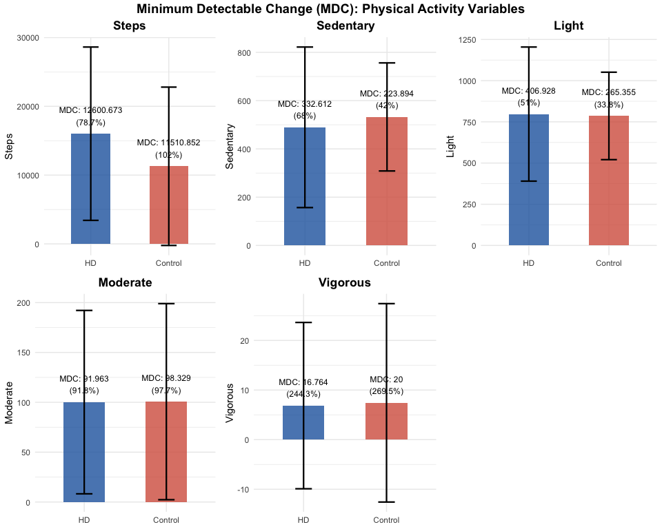<!-- -->
